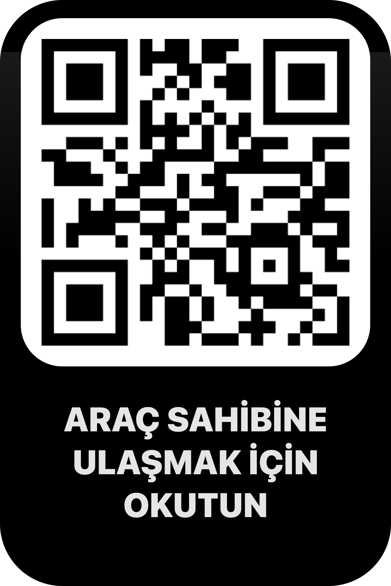
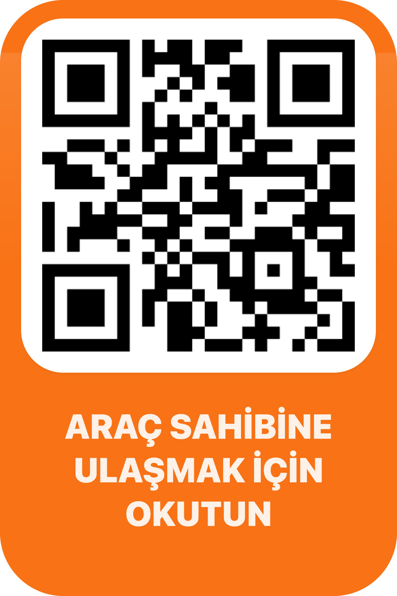
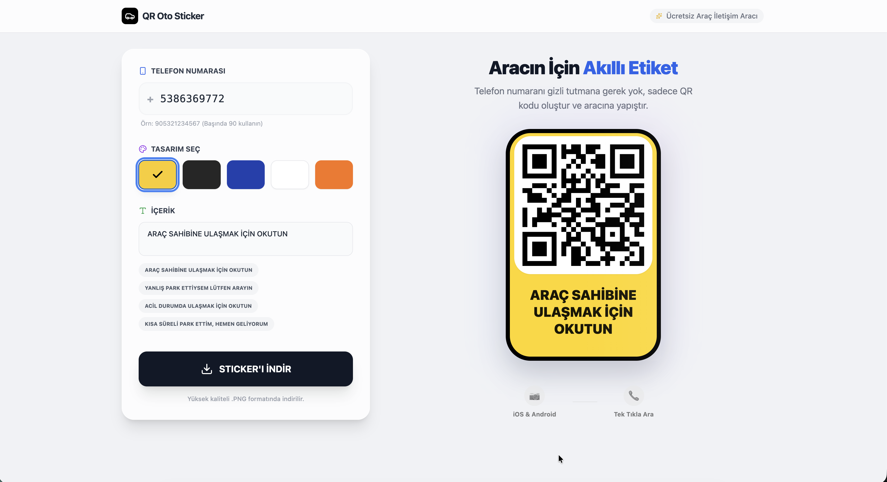

# QR Oto Sticker Generator

Araç camı için özel QR kodlu sticker'lar oluşturan modern ve kullanıcı dostu web uygulaması. Telefon numaranızı QR koda çevirerek, insanların sizinle kolayca iletişim kurabilmesini sağlayın.

## 🚗 Özellikler

- **5 Farklı Tema**: Klasik, Koyu, Mavi, Beyaz ve Ultra temalar
- **Yüksek Kaliteli Çıktı**: Yüksek çözünürlükte PNG formatında indirme
- **Hızlı İletişim**: QR kod okutularak doğrudan telefon arama
- **Özelleştirilebilir İçerik**: Hazır mesaj şablonları veya kendi metninizi ekleyin
- **Canlı Önizleme**: Değişikliklerinizi anında görün
- **Modern Arayüz**: Responsive ve kullanıcı dostu tasarım

## 📸 Tema Örnekleri

### 1. Classic (Klasik) Tema
Parlak sarı arka plan ve siyah kenarlık ile klasik taksi sarısı görünümü. Yüksek görünürlük ve dikkat çekici tasarım.


*Klasik sarı tema - Siyah kenarlık ve parlak sarı arka plan*

### 2. Modern (Koyu) Tema
Siyah arka plan üzerinde beyaz metin ve QR kod. Modern ve şık görünüm.


*Koyu tema - Siyah arka plan, beyaz metin ve QR kod*

### 3. Navy (Mavi) Tema
Lacivert arka plan ile profesyonel ve güvenilir görünüm. Mavi tonlarında QR kod.


*Mavi tema - Lacivert arka plan ve mavi tonlarında QR kod*

### 4. Minimal (Beyaz) Tema
Temiz beyaz arka plan ile minimalist ve profesyonel tasarım. Gri kenarlık detayı.


*Beyaz tema - Minimalist tasarım, beyaz arka plan ve gri kenarlık*

### 5. Ultra Tema
Parlak turuncu renk ile cam üzerinde maksimum görünürlük. Cam sticker'lar için ideal renk seçimi.


*Ultra tema - Parlak turuncu arka plan, camda mükemmel görünürlük*

## 🖥️ Uygulama Arayüzü


*Kontrol paneli (sol) ve canlı önizleme (sağ) ile kullanıcı dostu arayüz*

## 🚀 Kurulum ve Kullanım

### Gereksinimler
- Node.js (v18 veya üzeri)

### Kurulum

1. Bağımlılıkları yükleyin:
```bash
npm install
```

2. Geliştirme sunucusunu başlatın:
```bash
npm run dev
```

3. Tarayıcınızda `http://localhost:5173` adresine gidin

### Üretim Build'i

```bash
npm run build
```

Build edilmiş dosyalar `dist` klasöründe oluşturulur.

## 📱 Kullanım

1. **Telefon Numarası**: Telefon numaranızı girin (90 ile başlayan format: 905551234567)
2. **Tema Seçin**: 5 farklı temadan birini seçin
3. **İçerik Düzenleyin**: Hazır mesajları kullanın veya kendi metninizi yazın
4. **İndirin**: Yüksek kaliteli PNG formatında sticker'ı indirin
5. **Yapıştırın**: Sticker'ı aracınızın camına yapıştırın!

## 🛠️ Teknolojiler

- **React 19** - Modern UI kütüphanesi
- **TypeScript** - Tip güvenliği
- **Vite** - Hızlı build tool
- **Tailwind CSS** - Utility-first CSS framework
- **QRCode.react** - QR kod oluşturma
- **html-to-image** - Yüksek kaliteli görüntü export

## 📄 Lisans

Bu proje özel kullanım içindir.

## 💡 İpuçları

- Ultra tema, cam sticker'lar için en iyi görünürlüğü sağlar
- QR kodun okunabilirliği için yeterli boşluk bırakın
- Sticker'ı düz ve temiz bir yüzeye yapıştırın
- Telefon numaranızı doğru formatta girin (90 ile başlayan 12 haneli)
